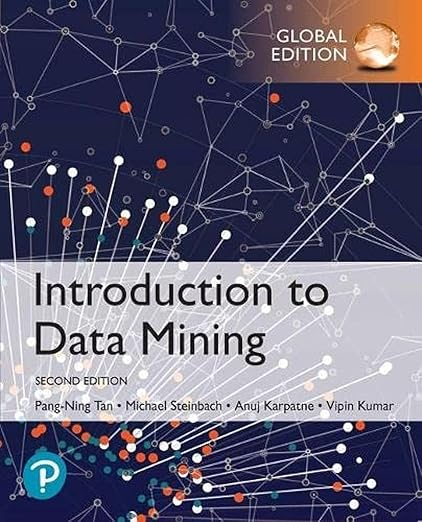

# Data-Mining-I

(https://www-users.cse.umn.edu/~kumar001/dmbook/index.php)

Course offered by University of Mannheim 

The course contains 8 lectures and 8 exercise videos. The course it very detailed and it takes approximately 6-8 weeks to complete it. 

1. How to pursure the course
    1. Watch the Lecture Videos
    2. Watch Exercise Screencast 
    3. Solve the Exercise Task yourself 
    4. After Solving the task you can compare your result to the solution availaible

## Lecture videos 
1. [Introduction to Data Mining ](https://data.dws.informatik.uni-mannheim.de/videos/DMI/V1_IntroductionToDataMining/)
2. [Clustering](https://data.dws.informatik.uni-mannheim.de/videos/DMI/V2_ClusterAnalysis/)
3. [Classification 1](https://data.dws.informatik.uni-mannheim.de/videos/DMI/V3_Classification/)
4. [Classification 2](https://data.dws.informatik.uni-mannheim.de/videos/DMI/V4_Classification/)
5. [Classification 3 ](https://data.dws.informatik.uni-mannheim.de/videos/DMI/V5_Classification/)
6. [Regression](https://data.dws.informatik.uni-mannheim.de/videos/DMI/V6_Regression/)
7. [Association Analysis](https://data.dws.informatik.uni-mannheim.de/videos/DMI/V7_AssociationAnalysis/)
8. [Text mining](https://data.dws.informatik.uni-mannheim.de/videos/DMI/V8_TextMining/)

Lecture slides for all the lectures [press here](https://github.dev/Sudhir-Joon/Data-Mining-I/tree/main)

## Exercise Screen cast 

1.[Introduction to Data Mining](https://data.dws.informatik.uni-mannheim.de/videos/DMI/exercise/python/01_SimplePreprocessingAndVisualization/01_SimplePreprocessingAndVisualizationFSS2022_Intro.m4v) - [solution](https://data.dws.informatik.uni-mannheim.de/videos/DMI/exercise/python/01_SimplePreprocessingAndVisualization/01_SimplePreprocessingAndVisualizationFSS2022_Intro.m4v)

2.[Clustering](https://data.dws.informatik.uni-mannheim.de/videos/DMI/exercise/python/02_Clustering/02_ClusteringFSS2022_Intro.m4v) - [solution](https://data.dws.informatik.uni-mannheim.de/videos/DMI/exercise/python/02_Clustering/02_ClusteringFSS2022_Solution.m4v)

3.[Classification 1](https://data.dws.informatik.uni-mannheim.de/videos/DMI/exercise/python/03_Classification/03_ClassificationFSS2022_Intro.mp4) - [solution](https://data.dws.informatik.uni-mannheim.de/videos/DMI/exercise/python/03_Classification/03_ClassificationFSS2022_Solution.mp4)

4.[Classification 2](https://data.dws.informatik.uni-mannheim.de/videos/DMI/exercise/python/04_Classification/04_ClassificationFSS2022_Intro.mp4) - [solution](https://data.dws.informatik.uni-mannheim.de/videos/DMI/exercise/python/04_Classification/04_ClassificationFSS2022_Solution.mp4)

5.[Classification 3 ](https://data.dws.informatik.uni-mannheim.de/videos/DMI/exercise/python/04_Classification/05_ClassificationFSS2022_Intro.mp4) - [solution](https://data.dws.informatik.uni-mannheim.de/videos/DMI/exercise/python/04_Classification/05_ClassificationFSS2022_Solution.mp4)

6.[Regression](https://data.dws.informatik.uni-mannheim.de/videos/DMI/exercise/python/06_Regression/06_RegressionFSS2022_Intro.mp4) - [Solution](https://data.dws.informatik.uni-mannheim.de/videos/DMI/exercise/python/06_Regression/06_RegressionFSS2022_Solution.mp4)

7.[Association Analysis](https://data.dws.informatik.uni-mannheim.de/videos/DMI/exercise/python/07_TextMining/07_TextMiningFSS2022_Intro.mp4) - [Solution](https://data.dws.informatik.uni-mannheim.de/videos/DMI/exercise/python/07_TextMining/07_TextMiningFSS2022_Solution.mp4)

8.[Text mining](https://data.dws.informatik.uni-mannheim.de/videos/DMI/exercise/python/08_AssociationAnalysis/08_AssociationAnalysisFSS2022_Intro.mp4) - [Solution](https://data.dws.informatik.uni-mannheim.de/videos/DMI/exercise/python/08_AssociationAnalysis/08_AssociationAnalysisFSS2022_Solution.mp4)